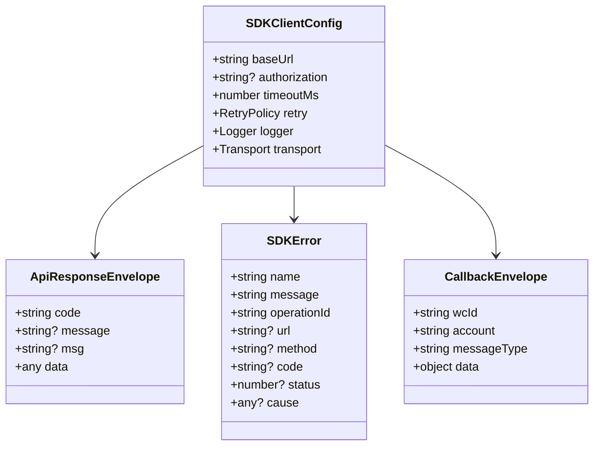

# Data Model（SDK Types）

> 说明：SDK 不持久化业务数据；本文件描述“SDK 内部需要稳定的类型/结构”，用于实现与测试的可复刻性。

## Type Relationship Diagram（概念）

## Core Types

### `SDKClientConfig`

| Field | Type | Null | Default | Constraints | Description |
|-------|------|------|---------|-------------|-------------|
| `baseUrl` | string | No | - | must be valid URL (no trailing slash preferred) | 平台 API 根地址（文档中为 `http://域名地址` 占位） |
| `authorization` | string | Yes | null | redacted in logs | Authorization token（来自登录接口返回） |
| `authorizationPrefix` | string | Yes | "" | e.g. `"Bearer "` | 是否为 token 添加前缀 |
| `timeoutMs` | number | Yes | 30_000 | >0 | 单请求超时 |
| `retry` | RetryPolicy | Yes | conservative | - | 重试策略（默认保守） |
| `logger` | Logger | Yes | console-like | - | 可插拔日志接口 |
| `transport` | Transport | Yes | fetch transport | - | 可注入 HTTP 传输层 |

### `TransportRequest` / `TransportResponse`

| Field | Type | Null | Default | Description |
|------|------|------|---------|-------------|
| `method` | string | No | - | `GET/POST/...` |
| `url` | string | No | - | 拼装后的完整 URL |
| `headers` | Record<string,string> | Yes | {} | header map（禁止默认输出敏感值到日志） |
| `body` | string/Uint8Array/stream | Yes | null | JSON/body（具体实现阶段确定） |

### `ApiResponseEnvelope<T>`

> 常见返回结构（多数文档示例）：`{ code, message, data }` 或 `msg` 字段。SDK 需兼容字段名差异。

| Field | Type | Null | Description |
|------|------|------|-------------|
| `code` | string \| number | No | 业务 code（常见：1000/1001） |
| `message`/`msg` | string | Yes | 文本信息 |
| `data` | T | Yes | 业务数据（不同接口不同） |

### `SDKError`（统一错误基类）

| Field | Type | Null | Description |
|------|------|------|-------------|
| `name` | string | No | 错误类型名 |
| `message` | string | No | 可读错误描述 |
| `operationId` | string | No | 对应 endpoint wrapper |
| `method` | string | Yes | HTTP 方法 |
| `url` | string | Yes | 完整 URL（可截断） |
| `status` | number | Yes | HTTP status（仅 HttpError） |
| `code` | string \| number | Yes | 业务 code（仅 ApiBusinessError） |
| `cause` | unknown | Yes | 原始异常（保留链路） |

派生错误类型：

| Type | When | Notes |
|------|------|------|
| `ValidationError` | 参数缺失/类型不合法 | 不发请求 |
| `NetworkError` | DNS/连接失败/超时 | 可能触发重试 |
| `HttpError` | HTTP 非 2xx | 保留 status 与响应片段 |
| `ApiBusinessError` | `code != successCode` | 默认 successCode=1000（可覆盖） |
| `ParseError` | 响应非 JSON/字段缺失 | 需要携带原始响应片段（截断） |

## Webhook / Callback Types

离线文档：`docs/api/api-wen-dang2/xiao-xi-jie-shou/shou-xiao-xi/callback.md`

SDK 需要提供两类能力：

1. **类型定义**：把 callback envelope 与常见消息类型字段做结构化（至少覆盖：`wcId/account/messageType/data/fromUser/toUser/msgId/newMsgId/timestamp/content/self`）。
2. **解析辅助**：提供 `parseCallbackPayload(json)`，做基本结构校验与字段提取；去重（dedup）由使用方实现，但 SDK 必须提供建议与示例。

### `CallbackEnvelope`

| Field | Type | Description |
|------|------|-------------|
| `wcId` | string | 微信 id |
| `account` | string | 账号 |
| `messageType` | string | 消息类型（详见文档的类型表） |
| `data` | object | 消息体（结构随 messageType 变化） |

### 去重（Dedup）建议字段

| Field | Location | Why |
|------|----------|-----|
| `data.newMsgId` | callback payload | 文档提示可用于逻辑去重 |
| `data.timestamp` | callback payload | 时间戳辅助（与 newMsgId 组合） |

## Mapping: Docs → SDK Types

离线文档中常见类型写法：`string/int/long/boolean/JSONObject/XML`。SDK 映射建议：

| Doc Type | SDK Type（TS） | Notes |
|---------|------------------|------|
| string | `string` | - |
| int/long | `number` | 超大整数需注意精度（如 msgId/newMsgId）；必要时用 string 承载并在运行时保留原文 |
| boolean | `boolean` | - |
| JSONObject | `Record<string, unknown>` | 可进一步细化 |
| XML | `string` | SDK 不解析 XML（除非明确需求），仅透传 |

