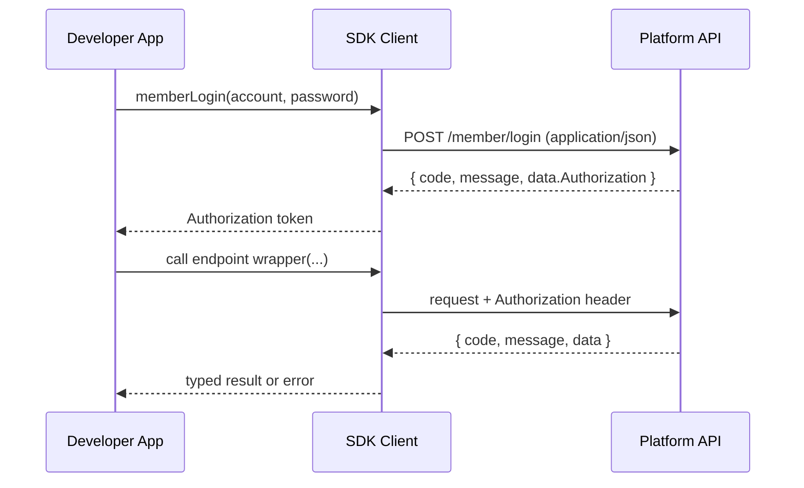

# Authentication & Authorization Design（SDK 视角）

## 目标与边界

- SDK 负责 **获取/注入** `Authorization` 以及提供安全默认值（脱敏、最小日志、可配置前缀）。
- SDK 不重新定义平台侧权限模型；平台如何鉴权/授权以离线文档与平台实际行为为准。

## Authentication Flow（基于离线文档）

离线文档示例：`docs/api/api-wen-dang2/deng-lu/deng-lu-wei-kong-ping-tai-di-yi-bu.md`

## Token Specification（约定与假设）

| Attribute | Value |
|-----------|-------|
| Header name | `Authorization` |
| Token source | 登录接口返回（文档描述：`Authorization：login接口返回`） |
| Token format | 默认原文注入；可配置 `authorizationPrefix`（例如 `Bearer `） |
| Lifetime | 文档示例显示“生成后永久有效”（需以平台实际为准） |
| Refresh strategy | 无统一刷新机制；当鉴权失败时需要重新登录或由使用方更新 token |
| Storage (SDK) | 默认仅内存（config/session）；不写磁盘 |
| Revocation | 未在文档中统一说明；SDK 不实现注销逻辑，仅提供调用接口能力（如有） |

## Authorization Model（平台侧）

离线文档未提供 RBAC/权限矩阵。SDK 侧采取以下最小策略：

- SDK 不做“角色/权限”判断，只做“是否需要 Authorization header”的技术要求
- 当平台返回状态字段（例如登录返回 `status`）时，SDK 应把该字段透出给使用方，供业务侧决策（冻结/到期等）

### Permissions（权限）说明

离线文档未给出可执行的 **permission/权限模型**（例如角色、权限点、资源范围），因此 SDK 的定位是：
- **不内置权限判断**：不尝试在客户端推断“是否有权调用某接口”
- **只保证错误可诊断**：当平台因权限不足拒绝时，SDK 必须把关键信息保留下来（`httpStatus`、`apiCode`、message、`operationId`、`requestId`），以便业务侧做授权/配额/账号状态处理

## Enforcement Points（SDK 内）

| Layer | Check | Implementation |
|-------|-------|---------------|
| Config | `baseUrl` 是否存在 | 初始化时校验 |
| Request pipeline | endpoint 是否需要鉴权 | 默认：除明确标注匿名的 endpoint 外均需要 |
| Logging | token 脱敏 | 默认启用；禁止明文输出 |
| Error mapping | 鉴权失败识别 | 依据 HTTP status/业务 code（需实测补齐规则） |

## Open Questions（需在集成测试中验证）

1. 鉴权失败返回的 HTTP status / 业务 code 是否稳定
2. `Authorization` 是否要求固定前缀
3. token 是否存在过期与刷新机制
